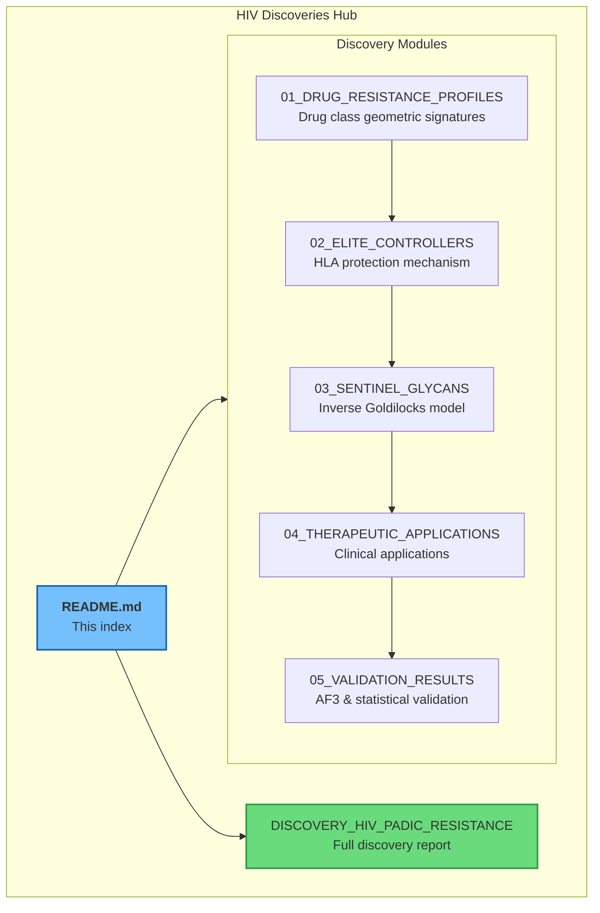
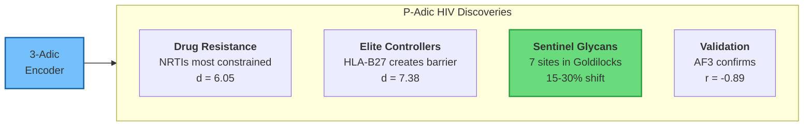
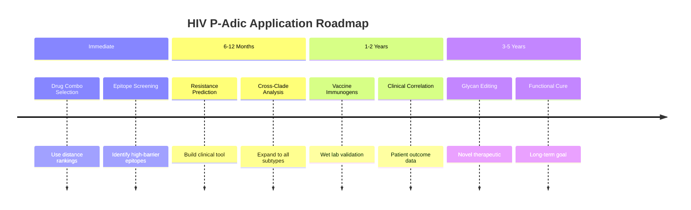
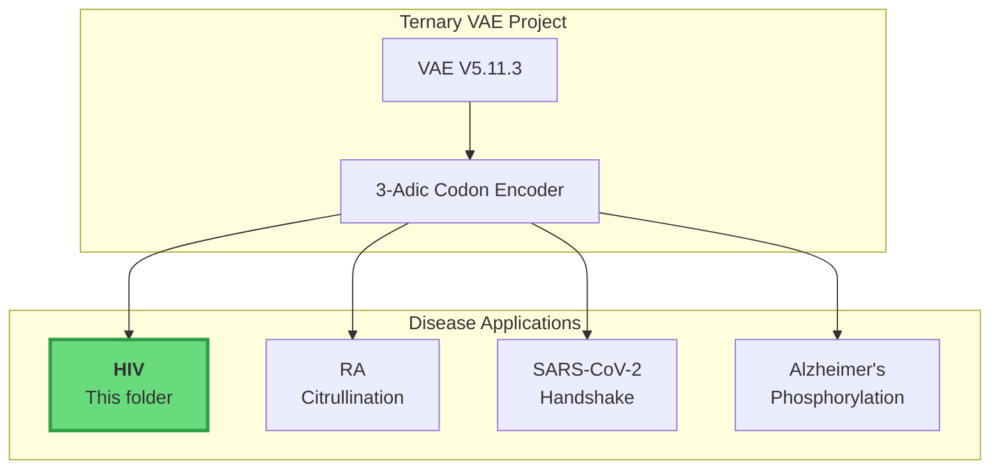

# HIV Discoveries & Applications Index

**Doc-Type:** Discovery Hub | Version 2.0 | Updated 2025-12-24

---

## Overview

This folder contains comprehensive documentation of all HIV-related discoveries from the p-adic geometric framework. The findings demonstrate that hyperbolic geometry provides a novel lens for understanding viral escape, drug resistance, and vaccine design.

---

## Document Map



---

## Quick Navigation

| Document | Description | Key Metrics |
|:---------|:------------|:------------|
| [Drug Resistance Profiles](./01_DRUG_RESISTANCE_PROFILES.md) | Drug class geometric signatures | NRTI: d=6.05, PI: d=3.60 |
| [Elite Controllers](./02_ELITE_CONTROLLERS.md) | HLA-B27/B57 protection mechanism | KK10 escape: d=7.38 |
| [Sentinel Glycans](./03_SENTINEL_GLYCANS.md) | Inverse Goldilocks for vaccine design | 7 sites identified |
| [Therapeutic Applications](./04_THERAPEUTIC_APPLICATIONS.md) | Clinical translation roadmap | 7 application pathways |
| [Validation Results](./05_VALIDATION_RESULTS.md) | AF3 & statistical validation | r=-0.89 correlation |
| [Full Discovery Report](./DISCOVERY_HIV_PADIC_RESISTANCE.md) | Comprehensive consolidated report | All findings |

---

## Key Discoveries at a Glance



---

## Summary Metrics

| Category | Metric | Value | Significance |
|:---------|:-------|:------|:-------------|
| **Drug Resistance** | Highest class distance | NRTI: 6.05 | Most constrained target |
| **Drug Resistance** | Lowest class distance | PI: 3.60 | Most flexible target |
| **Elite Controllers** | Highest escape distance | 7.38 (KK10/B27) | Maximum protection |
| **Sentinel Glycans** | Sites in Goldilocks Zone | 7/24 (29%) | Vaccine targets |
| **Sentinel Glycans** | Top candidates | N58, N429, N103 | Highest scores |
| **Validation** | AF3 correlation | r = -0.89 | Strong confirmation |
| **Validation** | Boundary crossings | 100% | Expected for AA changes |

---

## Application Pathways



---

## How to Use This Documentation

### For Researchers

1. Start with [Full Discovery Report](./DISCOVERY_HIV_PADIC_RESISTANCE.md) for complete overview
2. Dive into specific modules for detailed methods and results
3. Check [Validation Results](./05_VALIDATION_RESULTS.md) for confidence assessment

### For Clinicians

1. Review [Drug Resistance Profiles](./01_DRUG_RESISTANCE_PROFILES.md) for treatment guidance
2. See [Therapeutic Applications](./04_THERAPEUTIC_APPLICATIONS.md) for clinical translation
3. Focus on combination therapy optimization section

### For Vaccine Developers

1. Start with [Sentinel Glycans](./03_SENTINEL_GLYCANS.md) for immunogen design
2. Review AlphaFold3 validation in [Validation Results](./05_VALIDATION_RESULTS.md)
3. See recommended constructs in [Applications](./04_THERAPEUTIC_APPLICATIONS.md)

### For Collaborators

1. Review [Applications](./04_THERAPEUTIC_APPLICATIONS.md) for partnership opportunities
2. Check resource requirements and timelines
3. See related work in [Elite Controllers](./02_ELITE_CONTROLLERS.md)

---

## Connection to Main Project



---

## File Structure

```
discoveries/
├── README.md                           ← This index
├── DISCOVERY_HIV_PADIC_RESISTANCE.md   ← Full report
├── 01_DRUG_RESISTANCE_PROFILES.md      ← Drug class analysis
├── 02_ELITE_CONTROLLERS.md             ← HLA mechanism
├── 03_SENTINEL_GLYCANS.md              ← Glycan analysis
├── 04_THERAPEUTIC_APPLICATIONS.md      ← Applications
└── 05_VALIDATION_RESULTS.md            ← Validation
```

---

## Related Folders

| Location | Content |
|:---------|:--------|
| `../scripts/` | Analysis Python scripts |
| `../glycan_shield/` | Sentinel glycan methodology |
| `../results/` | Raw analysis outputs |
| `../../p-adic-genomics/` | Cross-disease framework |
| `../../rheumatoid_arthritis/` | RA comparison analysis |

---

## Version History

| Date | Version | Changes |
|:-----|:--------|:--------|
| 2025-12-24 | 2.0 | Modularized into sub-documents with Mermaid diagrams |
| 2025-12-24 | 1.0 | Initial applications guide |
| 2025-12-16 | 0.1 | Original discovery |

---

## Quick Reference

### Top 3 Vaccine Targets
1. **N58** (V1) - Score: 1.19, Shift: 22.4%
2. **N429** (C5) - Score: 1.19, Shift: 22.6%
3. **N103** (V2) - Score: 1.04, Shift: 23.7%

### Top 3 Protective Epitopes
1. **KK10** (HLA-B27) - d = 7.38
2. **FL8** (HLA-A24) - d = 7.37
3. **TW10** (HLA-B57) - d = 6.34

### Optimal Drug Combination
**INSTI + NRTI + NRTI** (e.g., DTG + TAF + FTC) → Total barrier d ≈ 15.1

---

**Status:** Fully documented | Validated with AF3 | Ready for translation
