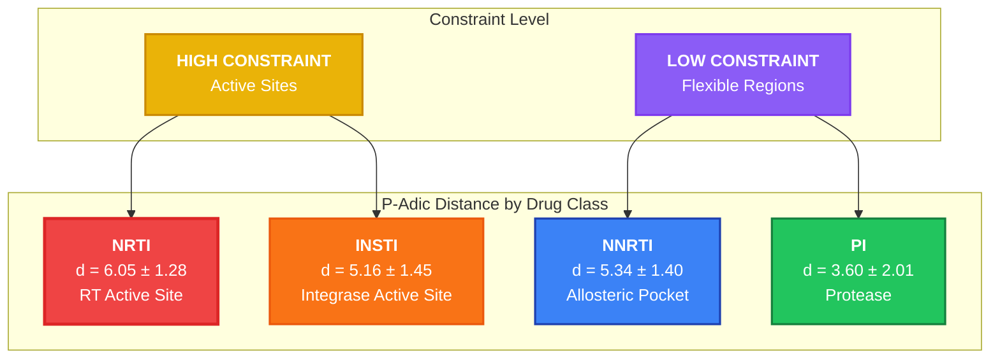
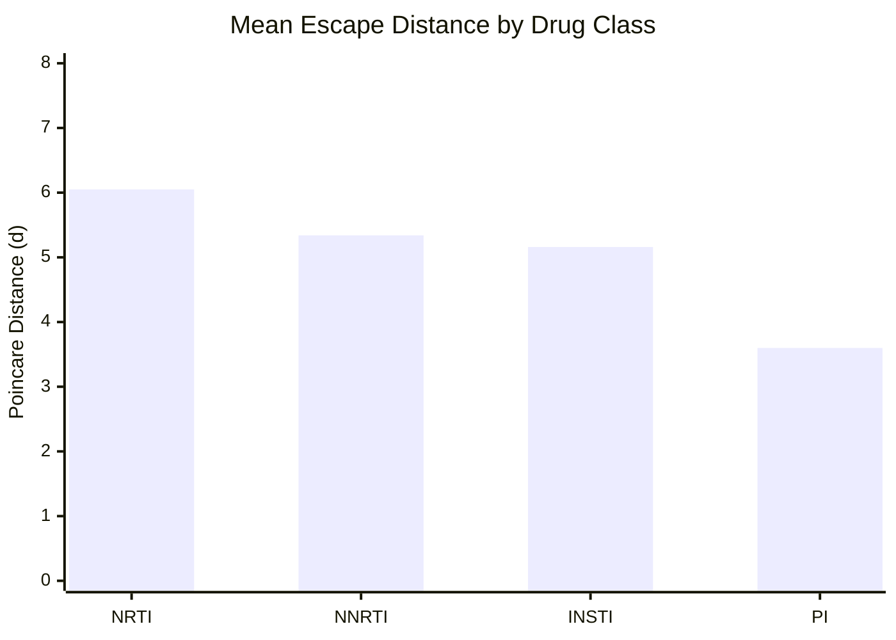
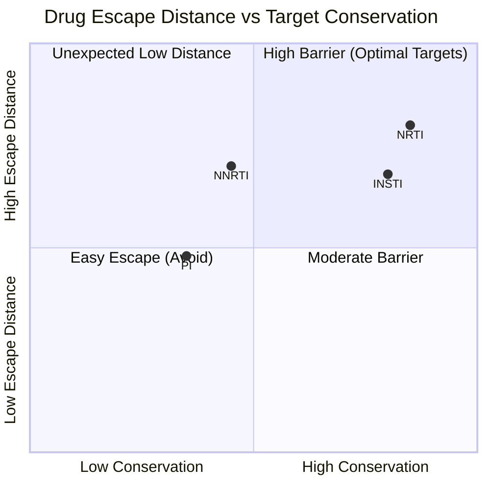
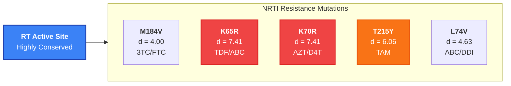
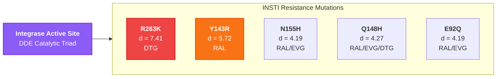
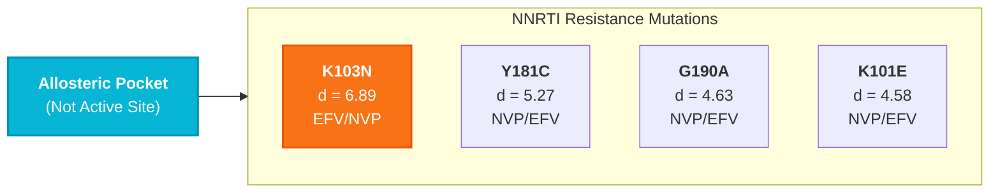
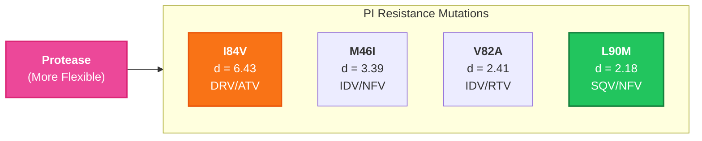
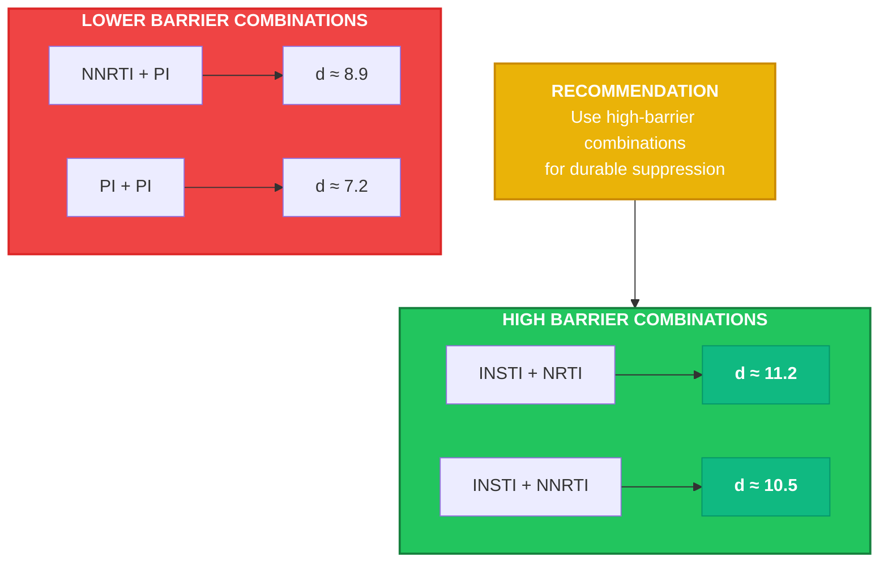
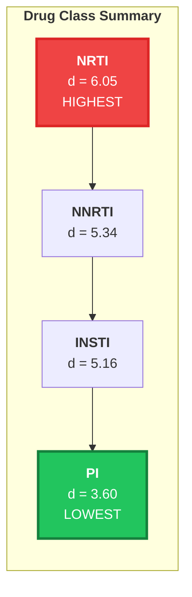

# Drug Resistance Geometric Profiles

**Doc-Type:** Discovery Module | Version 2.0 | Updated 2025-12-24

---

## Overview

Each antiretroviral drug class has a characteristic p-adic distance profile reflecting evolutionary constraint on its target site. Drugs targeting conserved active sites force the virus to make larger geometric "jumps" to escape - jumps that carry significant fitness costs.

---

## Drug Class Distance Hierarchy

---

## Distance Bar Chart

---

## Target Site Constraint Map

---

## Detailed Mutation Analysis

### NRTI Mutations (Nucleoside RT Inhibitors)

| Mutation | Distance | Drugs | Fitness Cost |
|:---------|:---------|:------|:-------------|
| K65R | 7.41 | TDF, ABC | Moderate |
| K70R | 7.41 | AZT, D4T | Moderate |
| T215Y | 6.06 | AZT, D4T | Minimal |
| L74V | 4.63 | ABC, DDI | Moderate |
| M184V | 4.00 | 3TC, FTC | Moderate |

**Mean: 6.05 ± 1.28**

---

### INSTI Mutations (Integrase Inhibitors)

| Mutation | Distance | Drugs | Fitness Cost |
|:---------|:---------|:------|:-------------|
| R263K | 7.41 | DTG | High |
| Y143R | 5.72 | RAL | Moderate |
| Q148H | 4.27 | RAL, EVG, DTG | Moderate |
| N155H | 4.19 | RAL, EVG | Moderate |
| E92Q | 4.19 | RAL, EVG | Minimal |

**Mean: 5.16 ± 1.45**

---

### NNRTI Mutations (Non-Nucleoside RT Inhibitors)

| Mutation | Distance | Drugs | Fitness Cost |
|:---------|:---------|:------|:-------------|
| K103N | 6.89 | EFV, NVP | Minimal |
| Y181C | 5.27 | NVP, EFV | Minimal |
| G190A | 4.63 | NVP, EFV | Minimal |
| K101E | 4.58 | NVP, EFV | Minimal |

**Mean: 5.34 ± 1.40**

---

### PI Mutations (Protease Inhibitors)

| Mutation | Distance | Drugs | Fitness Cost |
|:---------|:---------|:------|:-------------|
| I84V | 6.43 | DRV, ATV | Moderate |
| M46I | 3.39 | IDV, NFV | Minimal |
| V82A | 2.41 | IDV, RTV | Minimal |
| L90M | 2.18 | SQV, NFV | Minimal |

**Mean: 3.60 ± 2.01**

---

## Combination Therapy Implications

---

## Summary Metrics

---

## Key Insights

1. **NRTIs have highest constraint** - RT active site is catalytically essential
2. **INSTIs target conserved DDE triad** - Metal coordination must be preserved
3. **NNRTIs escape more easily** - Allosteric pocket tolerates substitutions
4. **PIs show high variability** - Protease is structurally more flexible

---

## Related Documents

- [Main Discovery Report](./DISCOVERY_HIV_PADIC_RESISTANCE.md)
- [Elite Controller Mechanism](./02_ELITE_CONTROLLERS.md)
- [Therapeutic Applications](./04_THERAPEUTIC_APPLICATIONS.md)

---

**Navigation:** [← Back to Index](./README.md) | [Next: Elite Controllers →](./02_ELITE_CONTROLLERS.md)
