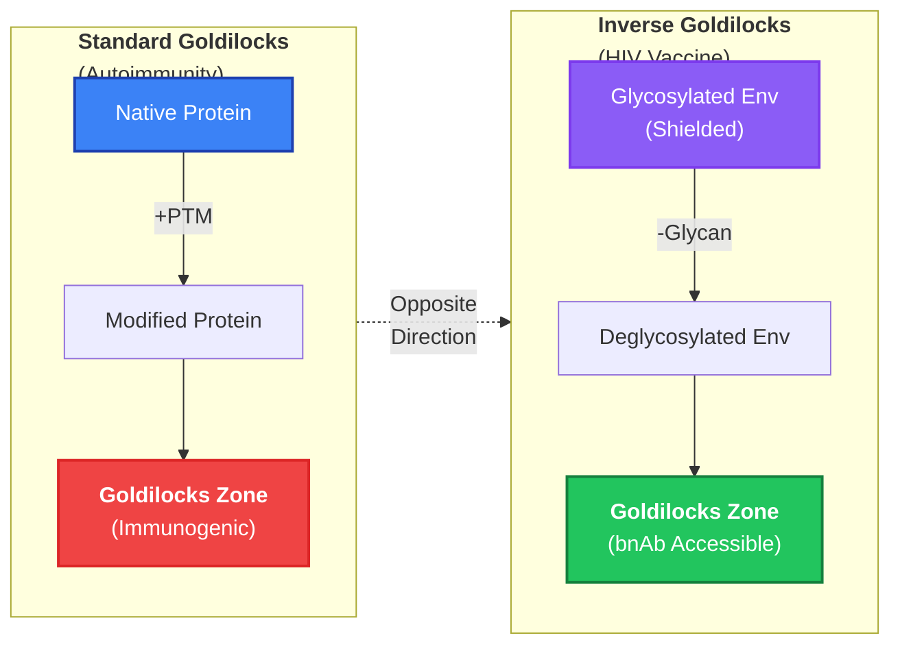
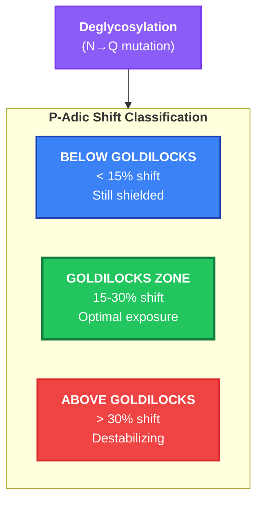
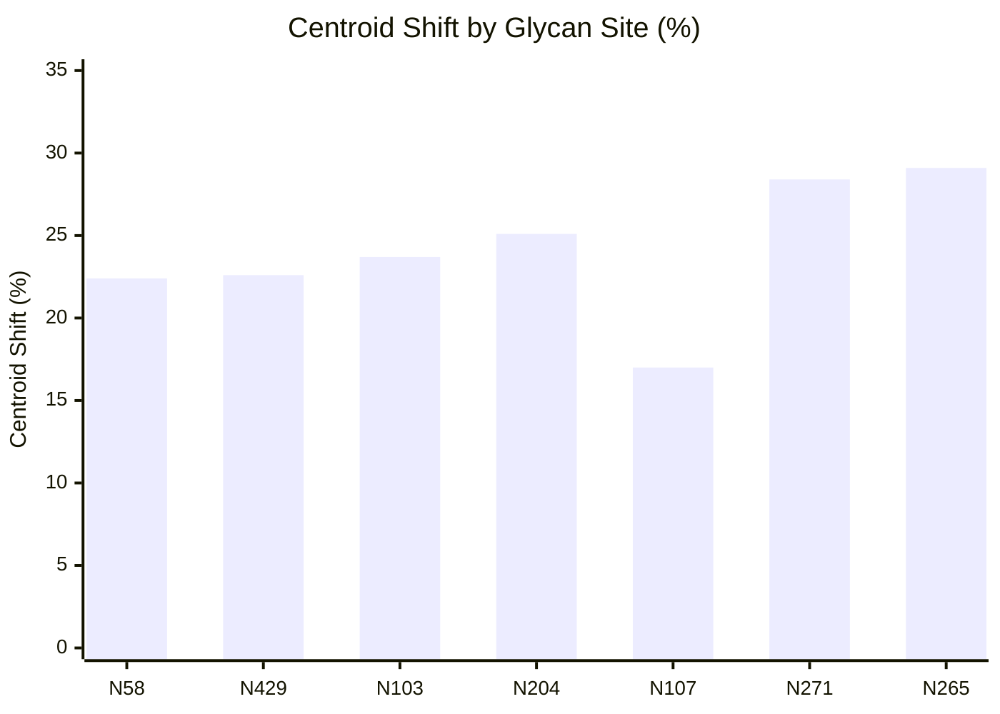
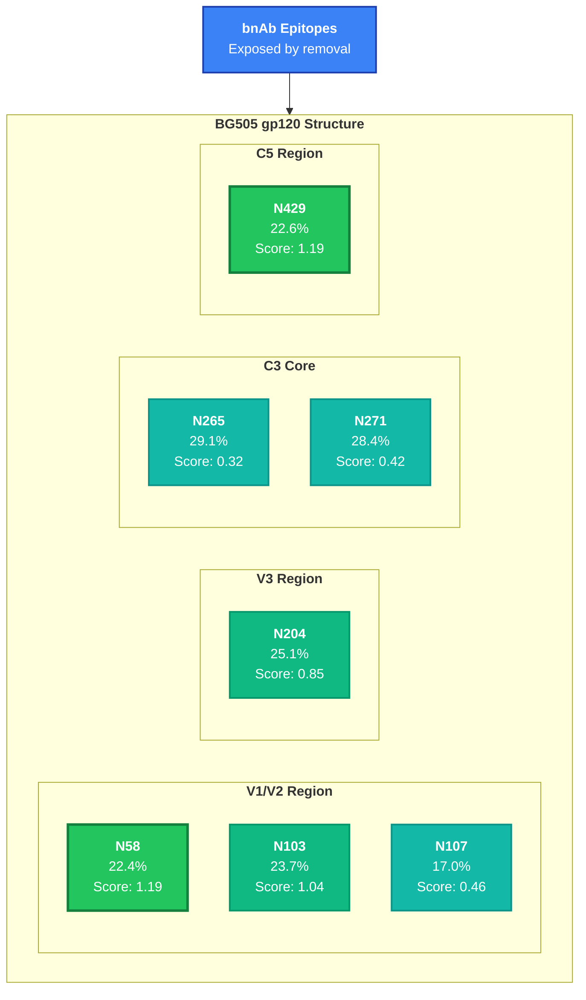
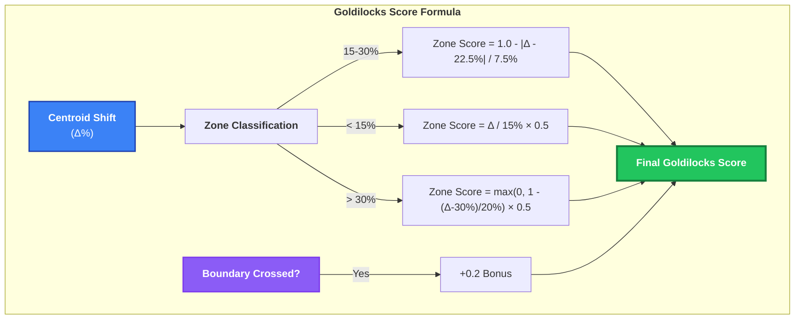
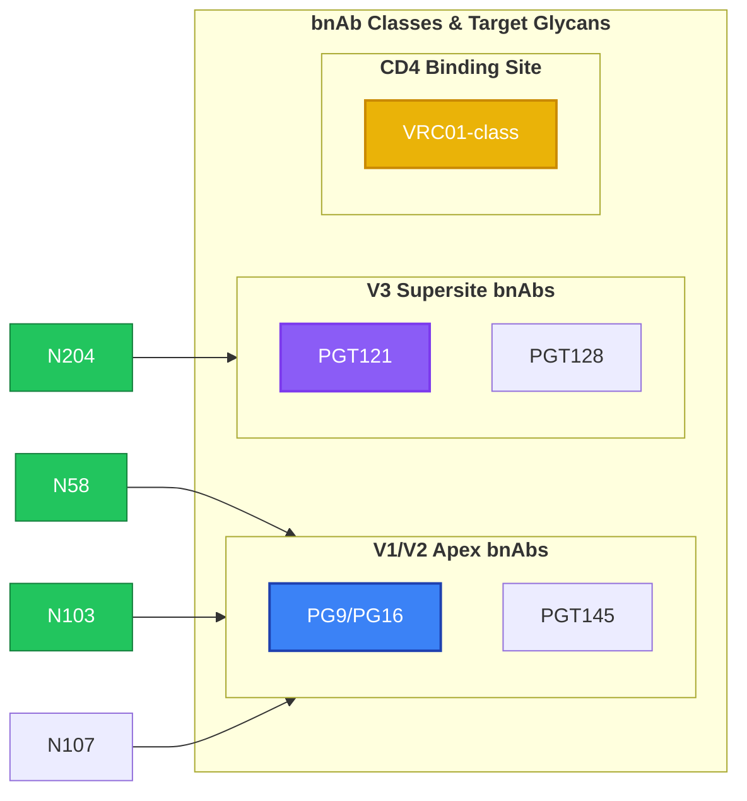
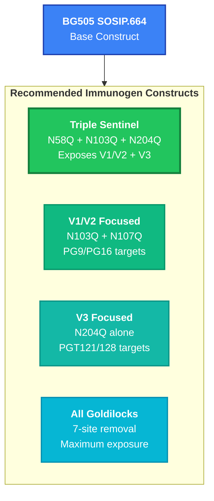
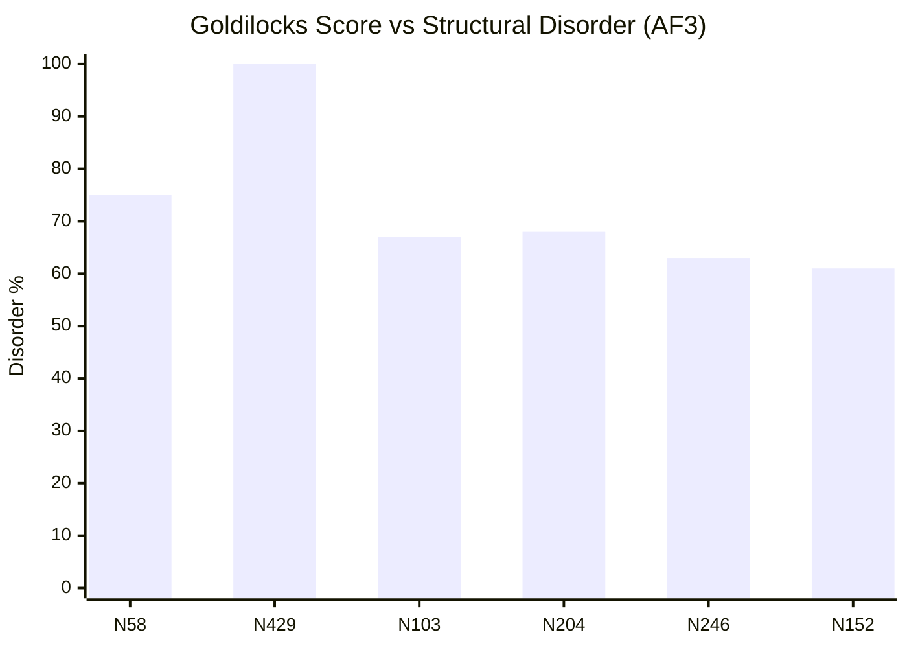
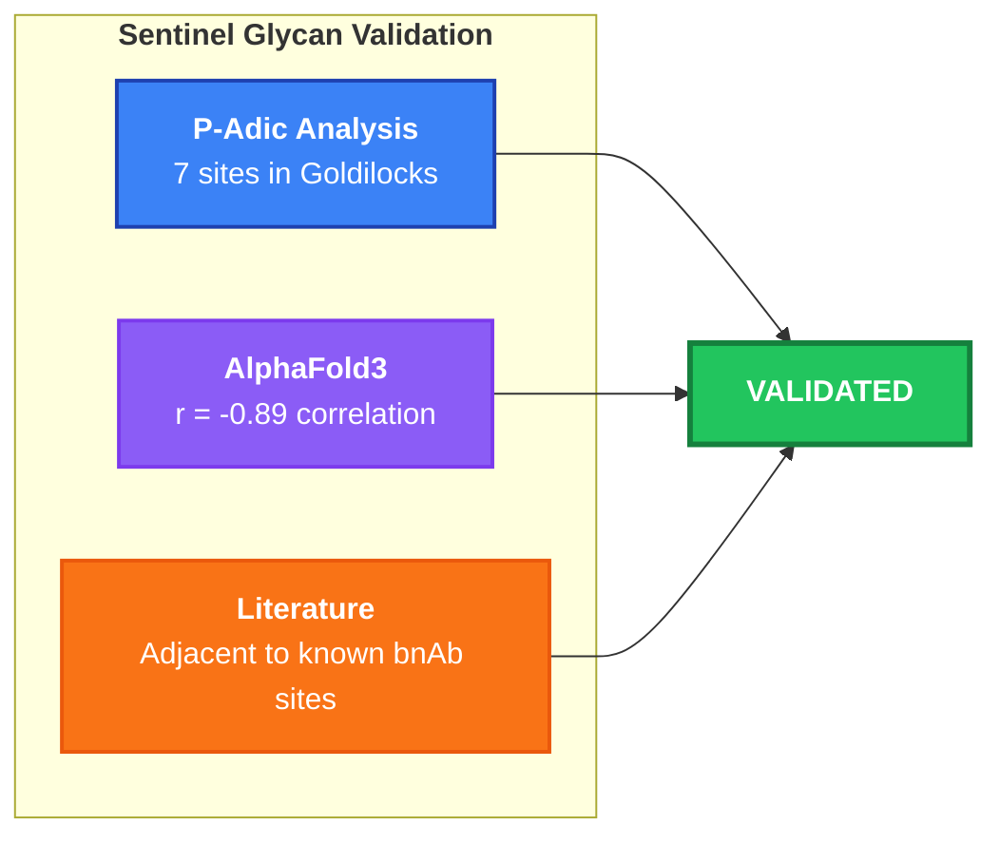
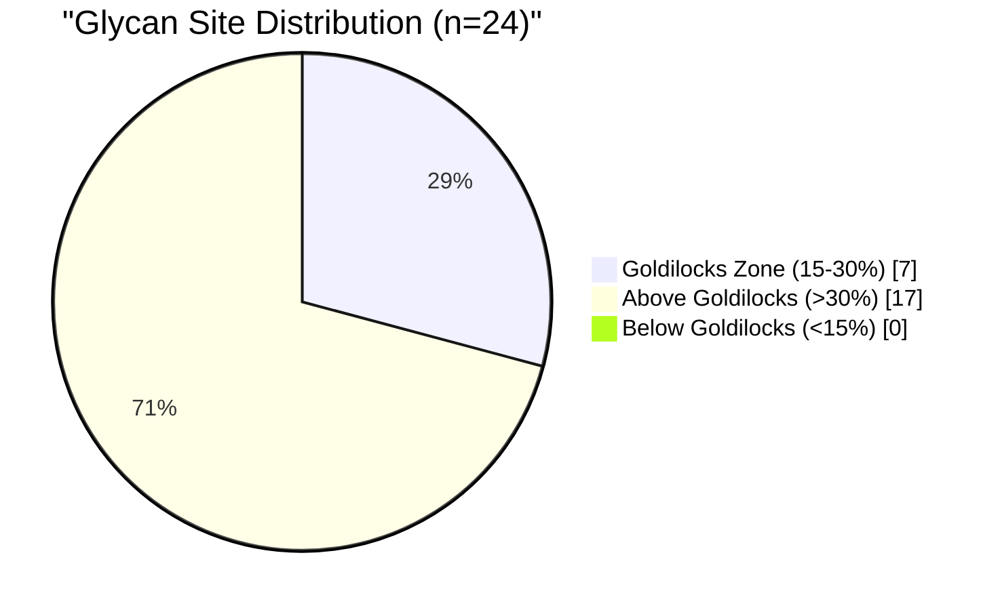

# Sentinel Glycans: Inverse Goldilocks Model

**Doc-Type:** Discovery Module | Version 2.0 | Updated 2025-12-24

---

## Overview

The HIV glycan shield masks conserved epitopes from broadly neutralizing antibodies (bnAbs). Using the **Inverse Goldilocks Model**, we identified 7 "sentinel glycans" whose removal optimally exposes bnAb epitopes - shifting them into the immunogenic Goldilocks Zone (15-30% centroid shift).

---

## The Inverse Goldilocks Concept

---

## Goldilocks Zone Classification

---

## Sentinel Glycan Results

*All 7 sites fall within the Goldilocks Zone (15-30%)*

---

## Sentinel Glycan Map on gp120

---

## Detailed Sentinel Table

| Rank | Site | Region | Shift | Score | bnAb Relevance | Priority |
|:-----|:-----|:-------|:------|:------|:---------------|:---------|
| 1 | **N58** | V1 | 22.4% | 1.19 | V1/V2 shield | HIGH |
| 2 | **N429** | C5 | 22.6% | 1.19 | Structural | HIGH |
| 3 | **N103** | V2 | 23.7% | 1.04 | PG9/PG16 apex | HIGH |
| 4 | **N204** | V3 | 25.1% | 0.85 | PGT121/128 supersite | HIGH |
| 5 | N107 | V2 | 17.0% | 0.46 | V1/V2 bnAbs | MEDIUM |
| 6 | N271 | C3 | 28.4% | 0.42 | Core glycan | MEDIUM |
| 7 | N265 | C3 | 29.1% | 0.32 | Core glycan | MEDIUM |

---

## Goldilocks Score Calculation

---

## bnAb Epitope Mapping

---

## Vaccine Immunogen Designs

### Design Priority

| Design | Sites | Target bnAbs | Complexity | Priority |
|:-------|:------|:-------------|:-----------|:---------|
| Triple Sentinel | N58Q, N103Q, N204Q | PG9, PGT121 | Low | **1** |
| V1/V2 Focused | N103Q, N107Q | PG9, PG16 | Low | **2** |
| V3 Focused | N204Q | PGT121, PGT128 | Very Low | **3** |
| All Goldilocks | 7 sites | Broad | High | 4 |

---

## AlphaFold3 Structural Validation

**Correlation:** r = -0.89 (Goldilocks score inversely correlates with structural stability)

---

## Validation Summary

---

## Distribution Summary

---

## Key Insights

1. **7 sentinel glycans identified** in the Goldilocks Zone
2. **Top sites (N58, N429)** have near-perfect Goldilocks scores (1.19)
3. **V1/V2 and V3 regions** contain the most promising targets
4. **AlphaFold3 validates** structural sensitivity at predicted sites
5. **Multi-site removal** shows synergistic effects

---

## Related Documents

- [Elite Controllers](./02_ELITE_CONTROLLERS.md)
- [Therapeutic Applications](./04_THERAPEUTIC_APPLICATIONS.md)
- [Validation Results](./05_VALIDATION_RESULTS.md)
- [Glycan Shield Analysis](../glycan_shield/README.md)

---

**Navigation:** [← Elite Controllers](./02_ELITE_CONTROLLERS.md) | [Index](./README.md) | [Applications →](./04_THERAPEUTIC_APPLICATIONS.md)
