# Therapeutic Applications

**Doc-Type:** Discovery Module | Version 2.0 | Updated 2025-12-24

---

## Overview

The p-adic geometric framework enables multiple therapeutic applications for HIV - from vaccine design to personalized treatment optimization to novel glycan editing approaches.

---

## Application Roadmap

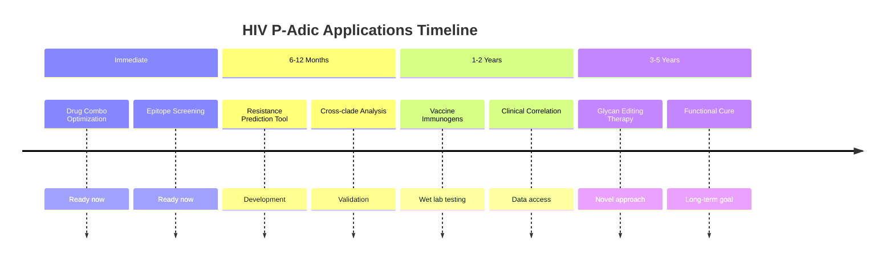

---

## Application Overview

<div align="center">
  
  <p><em>Figure 1: Integrated Therapeutic Landscape - From molecular drug design to functional cures.</em></p>
</div>

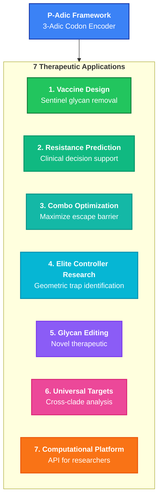

---

## Application 1: Vaccine Immunogen Design

### Concept

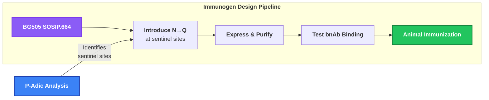

### Recommended Constructs

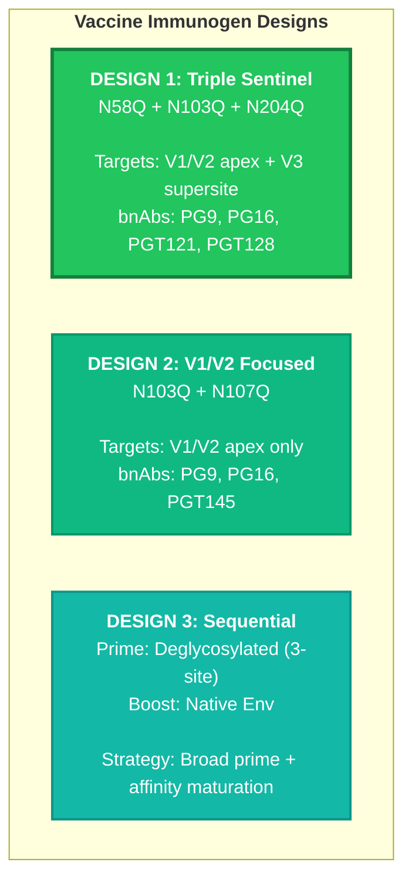

---

## Application 2: Drug Resistance Prediction

### Pipeline

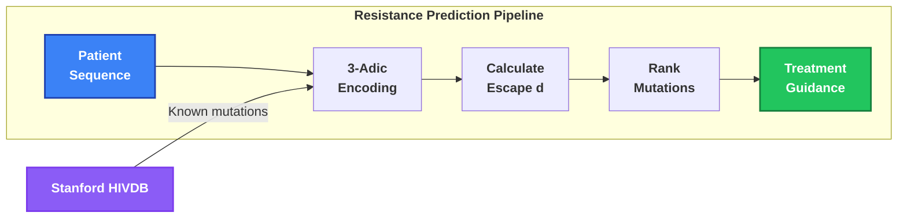

### Clinical Decision Support

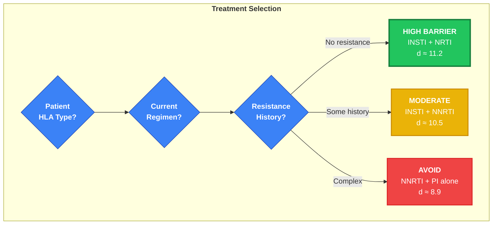

---

## Application 3: Combination Therapy Optimization

### Geometric Barrier Concept

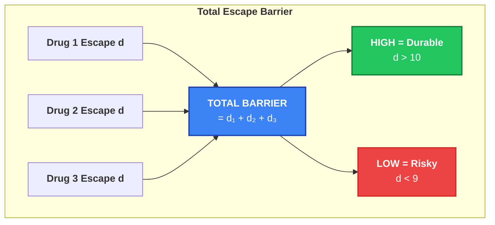

### Combination Rankings

| Combination             | Components      | Total Barrier | Recommendation |
| :---------------------- | :-------------- | :------------ | :------------- |
| **INSTI + NRTI + NRTI** | DTG + TAF + FTC | ~15.1         | OPTIMAL        |
| **INSTI + NRTI**        | DTG + TAF       | ~11.2         | Excellent      |
| **INSTI + NNRTI**       | DTG + EFV       | ~10.5         | Good           |
| NNRTI + NRTI            | EFV + TDF       | ~9.5          | Moderate       |
| NNRTI + PI              | EFV + ATV       | ~8.9          | Caution        |

---

## Application 4: Elite Controller Research

### Geometric Trap Identification

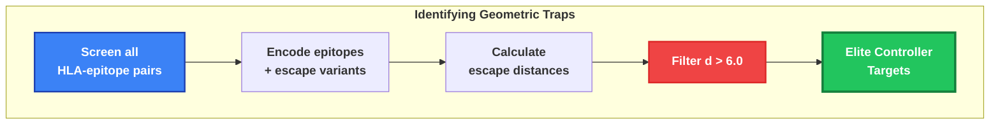

### Known High-Distance Epitopes

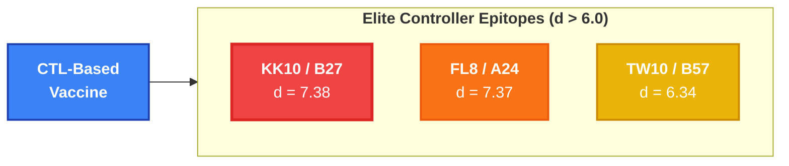

---

## Application 5: Glycan Editing Therapy (Novel)

### Concept

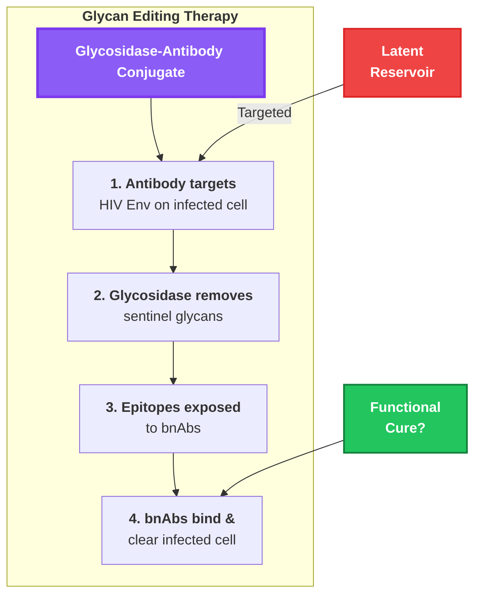

### Development Pathway

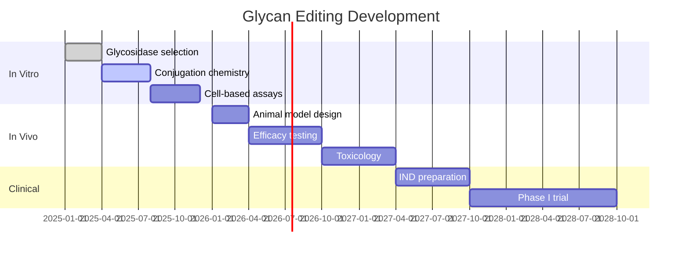

---

## Application 6: Universal Vaccine Targets

### Cross-Clade Sentinel Analysis

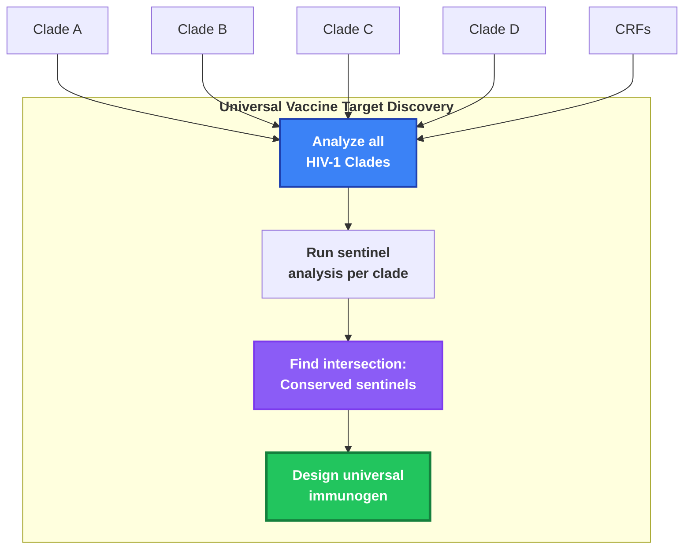

---

## Application 7: Computational Platform

### API Concept


### Example Usage

```python
from hiv_padic import HIVAnalyzer

# Initialize with encoder
analyzer = HIVAnalyzer(encoder="3adic_v5.11.3")

# Analyze a mutation
result = analyzer.analyze_mutation("RT", "M184V")
print(f"Escape distance: {result.distance}")  # 4.00

# Rank epitopes for a patient
epitopes = analyzer.rank_epitopes(
    patient_hla=["B*27:05", "A*02:01"]
)
# Returns sorted by escape barrier

# Optimize immunogen design
design = analyzer.optimize_immunogen(
    target_bnabs=["VRC01", "PGT121"],
    max_sites=3
)
# Returns: ["N58Q", "N103Q", "N204Q"]

# Predict resistance risk
risk = analyzer.predict_resistance(
    patient_sequence="...",
    regimen=["DTG", "TAF", "FTC"]
)
# Returns per-mutation probability
```

---

## Impact Summary

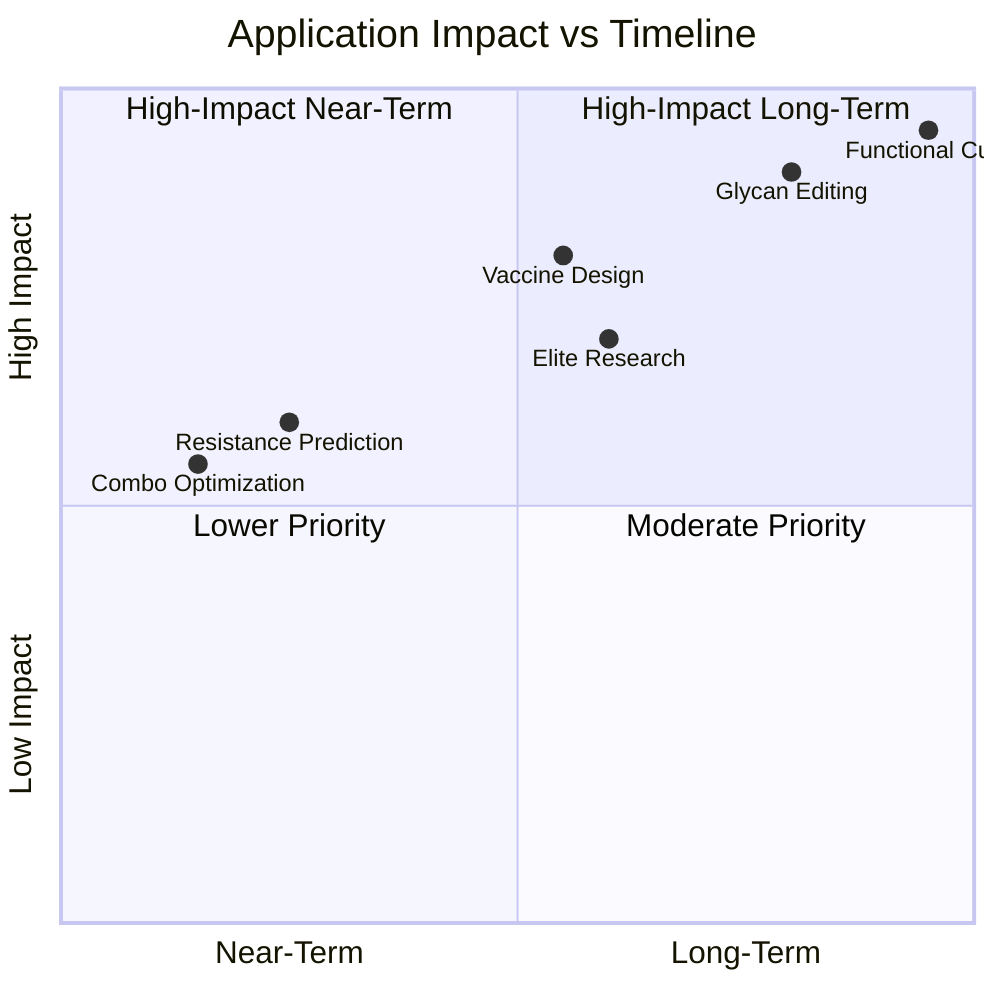

---

## Priority Matrix

| Application               | Timeline  | Impact         | Resources | Priority |
| :------------------------ | :-------- | :------------- | :-------- | :------- |
| Combo Optimization        | Immediate | Medium         | Low       | **1**    |
| Resistance Prediction     | 6-12 mo   | Medium         | Medium    | **2**    |
| Vaccine Immunogens        | 1-2 yr    | High           | High      | **3**    |
| Elite Controller Research | 2-3 yr    | High           | Medium    | **4**    |
| Glycan Editing            | 3-5 yr    | Very High      | Very High | **5**    |
| Functional Cure           | 5+ yr     | Transformative | Very High | **6**    |

---

## Related Documents

- [Drug Resistance Profiles](./01_DRUG_RESISTANCE_PROFILES.md)
- [Elite Controllers](./02_ELITE_CONTROLLERS.md)
- [Sentinel Glycans](./03_SENTINEL_GLYCANS.md)
- [Validation Results](./05_VALIDATION_RESULTS.md)

---

**Navigation:** [← Sentinel Glycans](./03_SENTINEL_GLYCANS.md) | [Index](./README.md) | [Validation →](./05_VALIDATION_RESULTS.md)
