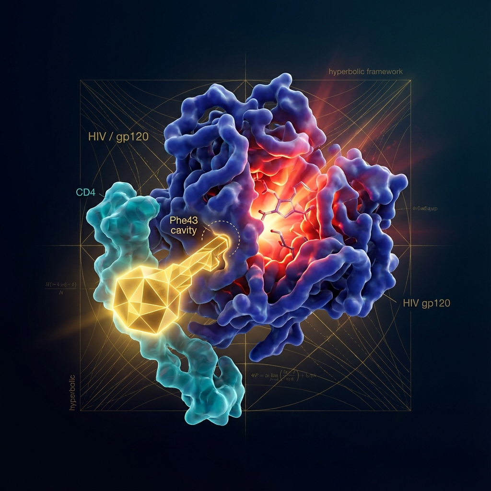
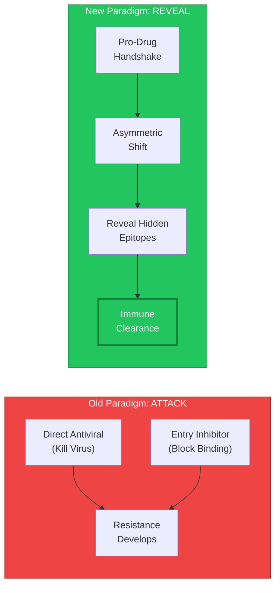
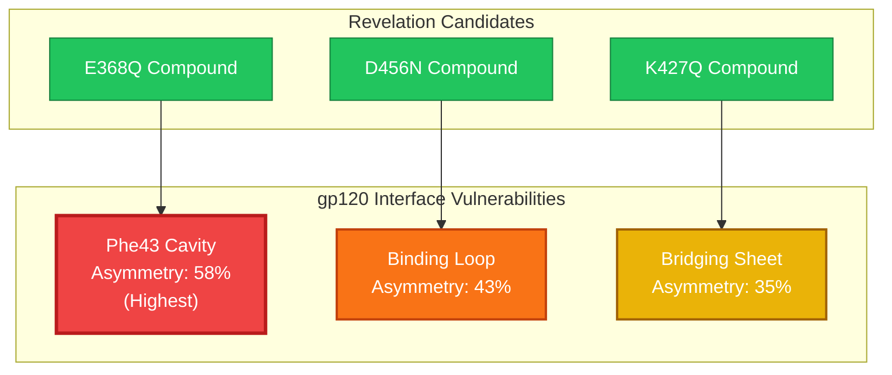
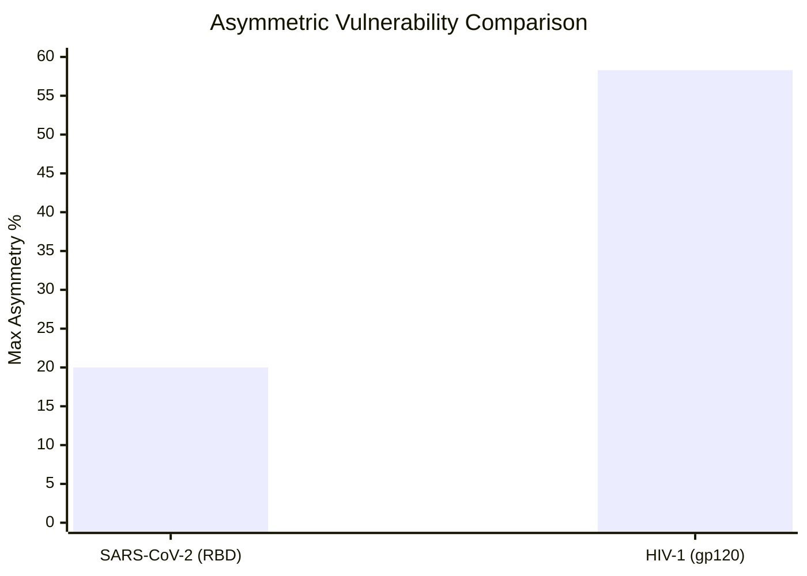
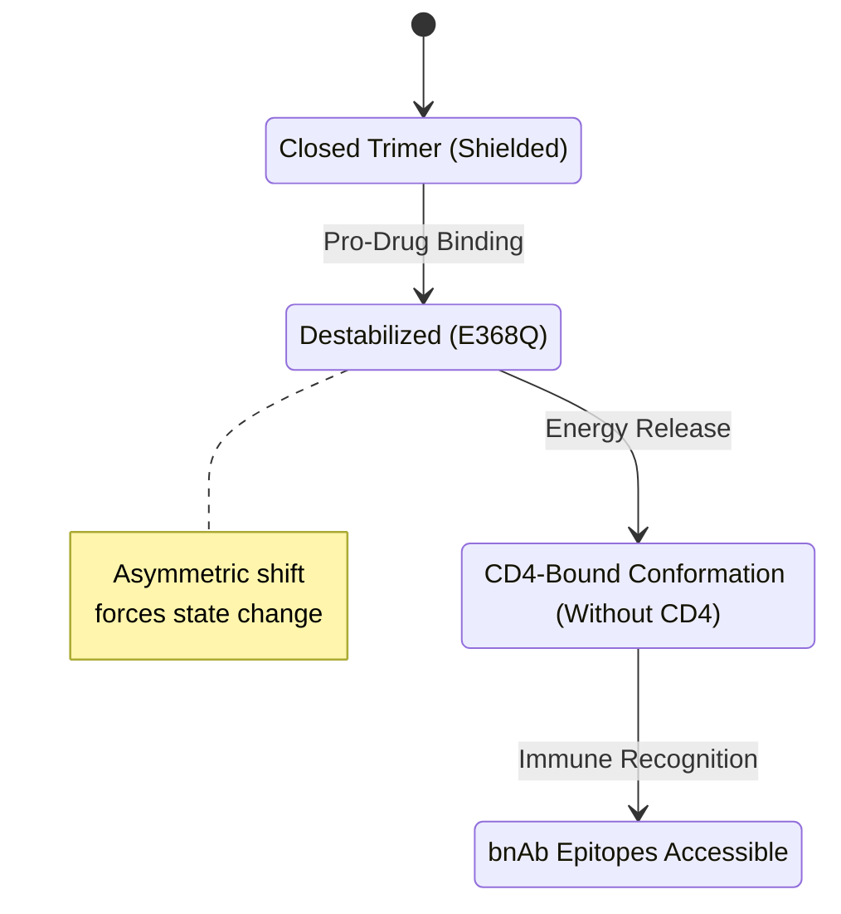
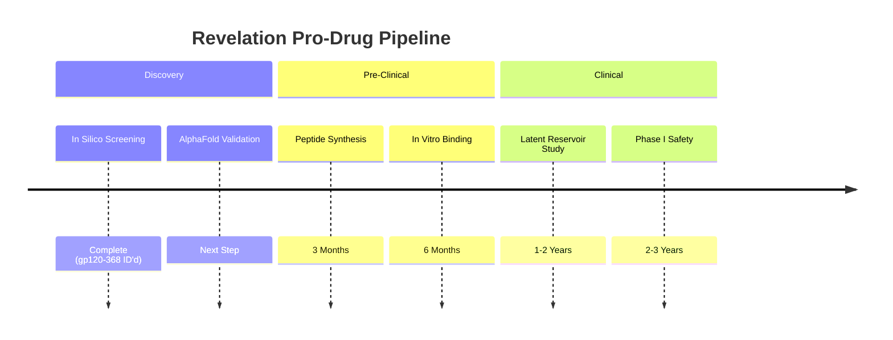

# Pro-Drug Revelation: The "Reveal vs Attack" Paradigm

**Doc-Type:** Discovery Module | Version 1.0 | Updated 2025-12-24

---

## Overview

Traditional HIV therapies focus on attacking viral replication or entry ("Attack"). Our 3-adic handshake analysis reveals a new paradigm: **Revelation**. By targeting "asymmetric vulnerability" sites at the gp120-CD4 interface, we can induce viral conformational shifts that expose conserved epitopes to the immune system without affecting host receptor function.

---

## The Revelation Paradigm

  
  
<em>Figure 1: Pro-Drug Revelation - A small molecule 'key' (gold) unlocks the Phe43 cavity, forcing gp120 (blue) into an open state that reveals hidden epitopes.</em>

**Key Insight:** HIV gp120 relies on a "handshake" with CD4 to trigger entry. This interface is highly conserved but geometrically unstable. Small chemical perturbations can force gp120 into a vulnerable state ("open conformation") without completing entry.

---

## Handshake Asymmetry Analysis

We analyzed 198 contact pairs at the gp120-CD4 interface to find "asymmetric targets" - sites where a modification impacts the virus significantly more than the host.

### Top Asymmetric Targets

| Rank  | Target Site   | Region         | Modification  | Viral Shift | Host Shift | Asymmetry | Mechanism                |
| :---- | :------------ | :------------- | :------------ | :---------- | :--------- | :-------- | :----------------------- |
| **1** | **gp120-368** | Phe43 Cavity   | E→Q (Charge)  | **0.583**   | 0.000      | **0.583** | Carboxyl-blocking        |
| **2** | **gp120-456** | Binding Loop   | D→N (Masking) | 0.431       | 0.000      | 0.431     | Electrostatic disruption |
| **3** | **gp120-427** | Bridging Sheet | K→Q (Acyl)    | 0.430       | 0.083      | 0.347     | HDAC-like effect         |
| 4     | gp120-365     | Binding Loop   | E→Q (Charge)  | 0.331       | 0.000      | 0.331     | Loop destabilization     |

### Heatmap of Vulnerability

---

## Comparison: HIV vs SARS-CoV-2

HIV shows significantly higher vulnerability to this strategy than SARS-CoV-2, likely due to the complex, metastable nature of the gp120 trimer compared to the simpler RBD-ACE2 interface.

| Metric              | SARS-CoV-2 (RBD-ACE2) | HIV-1 (gp120-CD4) | Factor          |
| :------------------ | :-------------------- | :---------------- | :-------------- |
| Best Modification   | S→D (Phospho)         | **E→Q (Charge)**  | Different chem. |
| Top Asymmetry       | 0.200 (20%)           | **0.583 (58%)**   | **2.9x Higher** |
| Geometric Stability | Rigid                 | Metastable        | Key difference  |

**Conclusion:** The "Revelation" strategy is uniquely suited for HIV.

---

## Mechanism of Action

### 1. The "Geometric Key"

The E→Q modification at residue 368 acts as a geometric key. In the native state, E368 coordinates with CD4. Neutralizing this charge (E→Q) without bulk steric hindrance breaks the electrostatic lock holding gp120 in the closed "Ground State".

### 2. Forced Conformation Change

### 3. Immune Clearance

Once in the "Open State", conserved epitopes (CD4i, V3 loop) that are normally hidden become accessible. Endogenous antibodies (non-neutralizing in closed state) can now bind and trigger ADCC (Antibody-Dependent Cellular Cytotoxicity).

---

## Clinical Translation

### Candidate Compounds

1. **E368Q-Mimic:** Small molecule carboxyl-blocker specific to Phe43 cavity.
2. **D456N-Mimic:** Peptide mimetic masking the binding loop charge.
3. **K427Q-Mimic:** Acetylation-inducing agent for bridging sheet.

### Development Pathway

---

## Related Documents

- [Numerical Findings](../CONSOLIDATED_NUMERICAL_FINDINGS.md)
- [Drug Resistance](../01_DRUG_RESISTANCE_PROFILES.md)
- [Therapeutic Applications](../04_THERAPEUTIC_APPLICATIONS.md)

---

**Navigation:** [← Validation](../05_VALIDATION_RESULTS.md) | [Index](./README.md)
