# In Silico Hypothesis: Sentinel Glycans and the Inverse Goldilocks Model

**Doc-Type:** In Silico Hypothesis | Version 2.0 | Updated 2025-12-24

---

## 1. Core Hypothesis

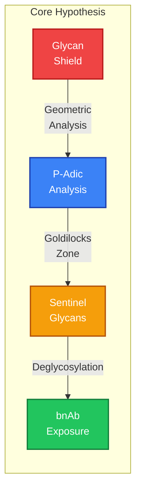

**The HIV glycan shield can be analyzed through p-adic geometry to identify "sentinel glycans" - specific N-linked glycosylation sites whose removal shifts viral epitopes into an immunogenic Goldilocks Zone, exposing broadly neutralizing antibody (bnAb) targets.**

This is the **inverse** of the RA autoimmunity model:

- **RA**: PTM _addition_ (citrullination) shifts self-proteins into immunogenic zone → autoimmunity
- **HIV**: PTM _removal_ (deglycosylation) shifts viral proteins into immunogenic zone → productive immunity

---

## 2. Background

### 2.1 The HIV Glycan Shield

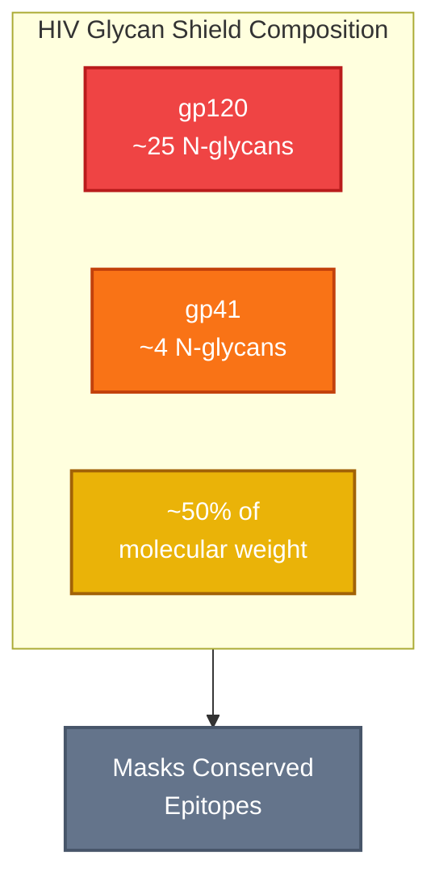

HIV-1 Env (gp120/gp41) is one of the most heavily glycosylated proteins known:

- ~25 N-linked glycosylation sites on gp120
- ~4 sites on gp41
- Glycans constitute ~50% of gp120 molecular weight
- Shield masks conserved epitopes from antibody recognition

### 2.2 N-Linked Glycosylation Sequon

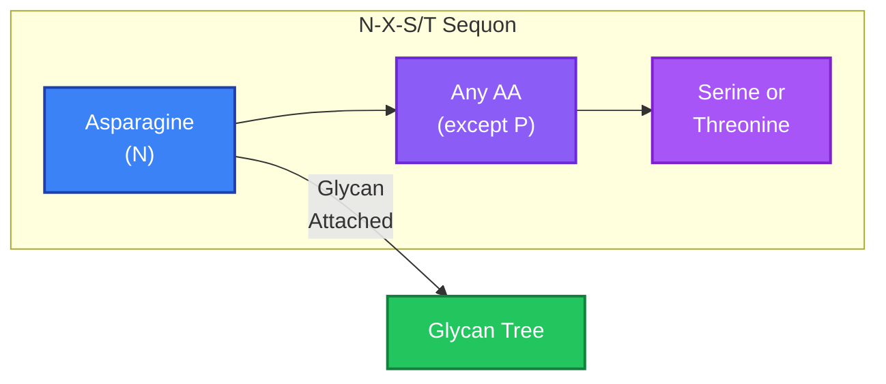

N-linked glycans attach at the consensus motif: **N-X-S/T** (where X ≠ P)

The asparagine (N) is modified. In p-adic terms:

- **Native:** N codon contributes to embedding
- **Glycosylated:** N + glycan tree (large structural perturbation)
- **Deglycosylated (mutant):** N→Q or N→D removes glycan attachment

### 2.3 Broadly Neutralizing Antibodies (bnAbs)

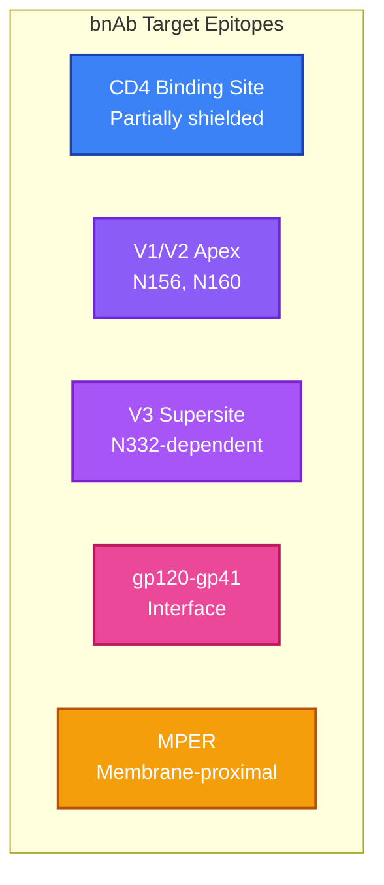

bnAbs target conserved epitopes often involving glycans:

- **CD4 binding site**: Partially shielded by surrounding glycans
- **V1/V2 apex**: Glycan-dependent epitope (N156, N160)
- **V3 glycan supersite**: N332-dependent
- **gp120-gp41 interface**: Masked by glycans
- **MPER**: Membrane-proximal, partially glycan-shielded

---

## 3. The Inverse Goldilocks Hypothesis

### 3.1 Model Comparison

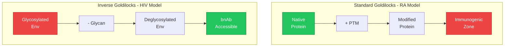

### 3.2 Prediction Framework

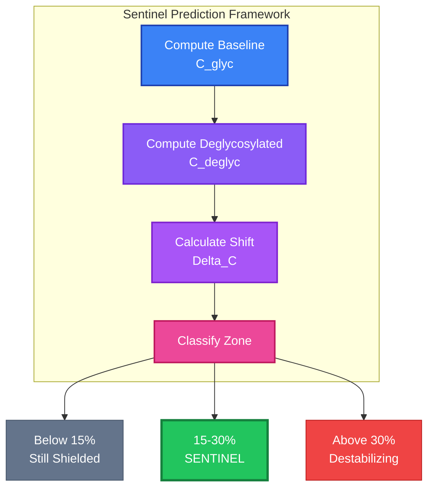

For each glycosylation site i:

1. **Compute baseline embedding**: C_glyc = embedding of glycosylated sequence context
2. **Compute deglycosylated embedding**: C_deglyc = embedding with N→Q mutation
3. **Calculate p-adic shift**: Δ_C = ||C_deglyc - C_glyc|| / ||C_glyc||
4. **Classify by Goldilocks Zone**:
   - Δ_C < 15%: Still shielded (insufficient exposure)
   - Δ_C ∈ [15%, 30%]: **Sentinel glycan** (optimal bnAb exposure)
   - Δ_C > 30%: Destabilizing (structural collapse, non-functional)

---

## 4. Key Differences from RA Model

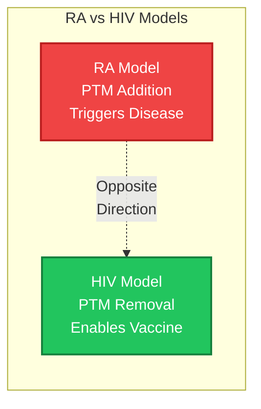

| Aspect             | RA (Citrullination) | HIV (Deglycosylation) |
| ------------------ | ------------------- | --------------------- |
| PTM direction      | Addition            | Removal               |
| Target             | Self-proteins       | Viral proteins        |
| Immune outcome     | Autoimmunity (bad)  | Neutralization (good) |
| Goldilocks meaning | Triggers disease    | Enables vaccine       |
| Clinical goal      | Avoid zone          | Target zone           |

---

## 5. Structural Considerations

### 5.1 Glycan Context Window

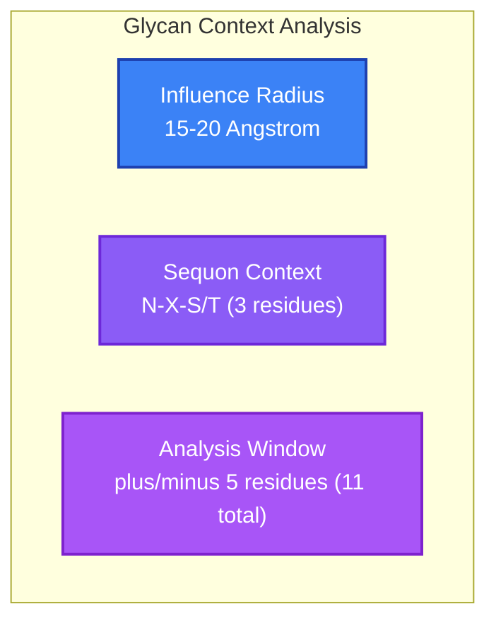

Unlike citrullination (single residue), glycosylation affects a larger structural neighborhood:

- **Glycan influence radius:** ~15-20 Angstrom
- **Sequon context:** N-X-S/T (3 residues minimum)
- **Analysis window:** ±5 residues from N (11 residues total)

### 5.2 Glycan-Glycan Interactions

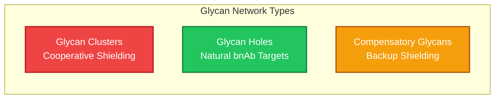

Some glycans form networks:

- **Glycan clusters**: Multiple nearby glycans with cooperative shielding
- **Glycan holes**: Natural gaps in the shield (bnAb targets)
- **Compensatory glycans**: Removal of one may expose another

### 5.3 Structural Validation (AlphaFold3)

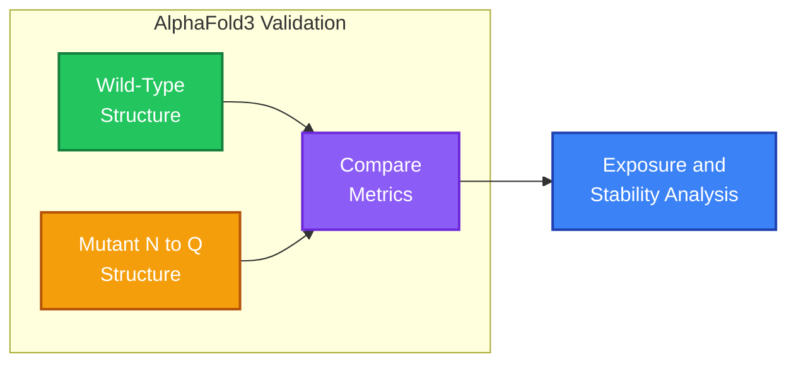

For top sentinel candidates, predict:

1. Wild-type structure (with glycan sequons)
2. Mutant structure (N→Q at sentinel site)
3. Compare: Exposure of underlying epitope, structural stability

---

## 6. Target Glycosylation Sites

### 6.1 Known bnAb-Related Glycans

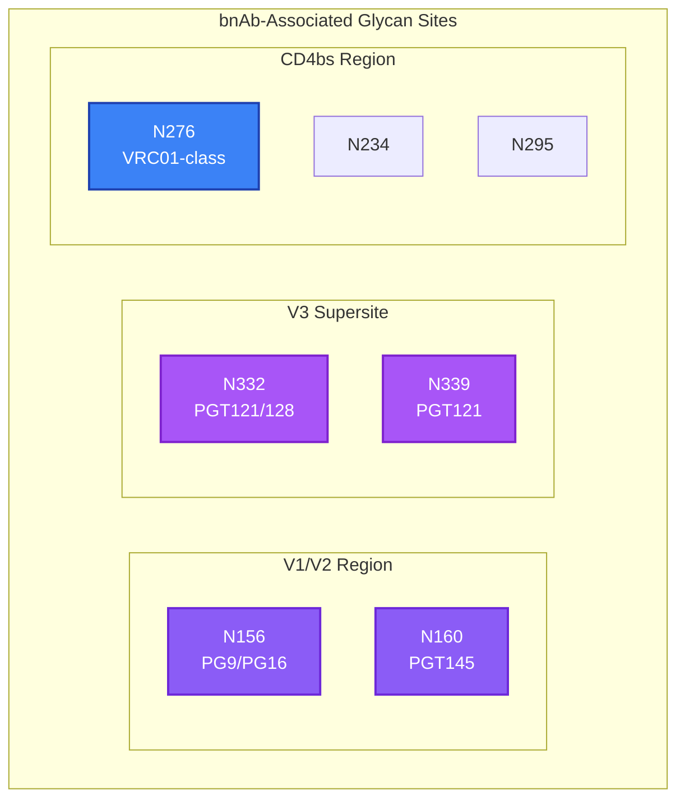

| Site | Region | bnAb Class  | Known Importance         |
| ---- | ------ | ----------- | ------------------------ |
| N156 | V1/V2  | PG9/PG16    | Critical for V1/V2 bnAbs |
| N160 | V1/V2  | PG9/PGT145  | Glycan-dependent epitope |
| N276 | C2     | VRC01-class | Shields CD4bs            |
| N332 | V3     | PGT121/128  | V3 glycan supersite      |
| N339 | V3     | PGT121      | V3 supersite             |
| N234 | C2     | Multiple    | Near CD4bs               |
| N295 | C2     | Multiple    | Near CD4bs               |
| N301 | V3     | 2G12        | High-mannose cluster     |
| N386 | C3     | Multiple    | gp120 core               |
| N392 | C3/V4  | Multiple    | Variable                 |
| N448 | C4     | Multiple    | gp120-gp41 interface     |
| N611 | gp41   | 10E8/MPER   | MPER shielding           |

### 6.2 Analysis Strategy

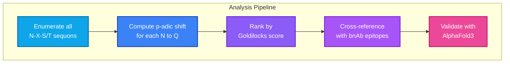

1. **Enumerate all N-X-S/T sequons** in reference Env (HXB2 or consensus)
2. **Compute p-adic shift** for each deglycosylation (N→Q)
3. **Rank by Goldilocks score**
4. **Cross-reference with known bnAb epitopes**
5. **Validate top hits with AlphaFold3**

---

## 7. Falsifiable Predictions

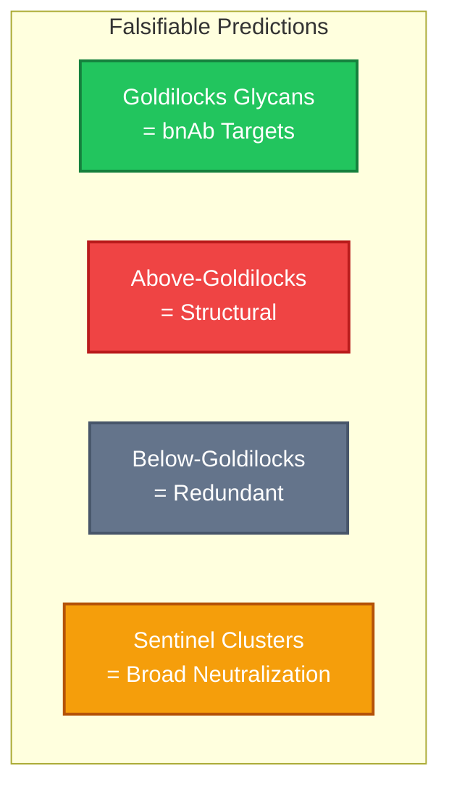

### Prediction 1: Goldilocks Glycans Are bnAb Targets

Sites with deglycosylation Δ_C in [15%, 30%] should:

- Correlate with known bnAb epitope glycans
- Show intermediate conservation (not too conserved, not too variable)

### Prediction 2: Non-Goldilocks Glycans Are Structural

Sites with Δ_C > 30% should:

- Be essential for Env folding/stability
- Mutation causes non-functional Env

### Prediction 3: Sub-Goldilocks Glycans Are Redundant

Sites with Δ_C < 15% should:

- Have nearby compensatory glycans
- Removal alone insufficient for bnAb access

### Prediction 4: Sentinel Clusters Enable Broad Neutralization

Multiple sentinel glycans in proximity should:

- Define optimal vaccine immunogen designs
- Predict multi-glycan deletion mutants for immunization

---

## 8. Experimental Validation Path

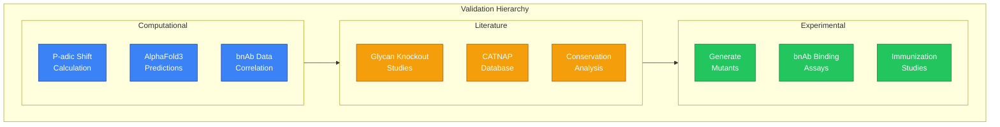

### 8.1 Computational (This Analysis)

1. P-adic shift calculation for all glycan sites
2. AlphaFold3 structure prediction for top candidates
3. Correlation with known bnAb binding data

### 8.2 Literature Validation

1. Compare predictions to published glycan knockout studies
2. Check against CATNAP database (bnAb-Env interactions)
3. Validate against glycan conservation in HIV sequence databases

### 8.3 Future Experimental (Out of Scope)

1. Generate predicted sentinel glycan mutants
2. Test binding to bnAb panels
3. Immunize with designed immunogens

---

## 9. Implications for Vaccine Design

### 9.1 Immunogen Design Strategy

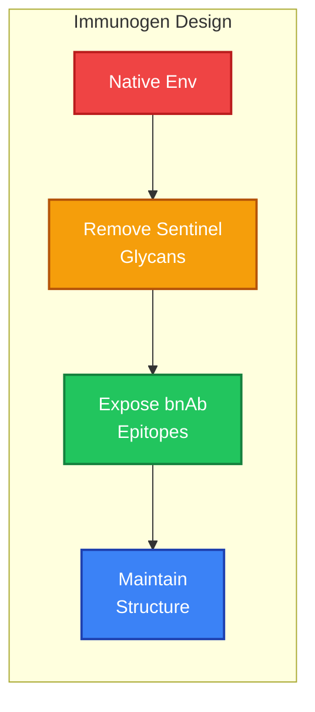

```
Optimal HIV immunogen = Env with sentinel glycans removed
                      = Exposes bnAb epitopes without structural collapse
                      = P-adic guided glycan deletion
```

### 9.2 Sequential Immunization

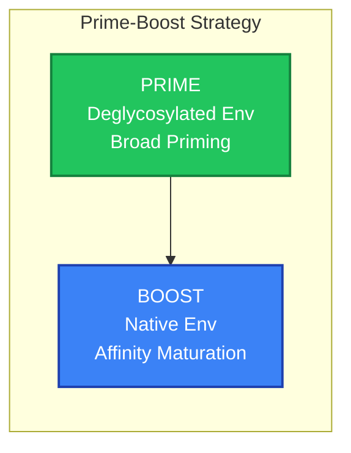

### 9.3 Mosaic Approaches

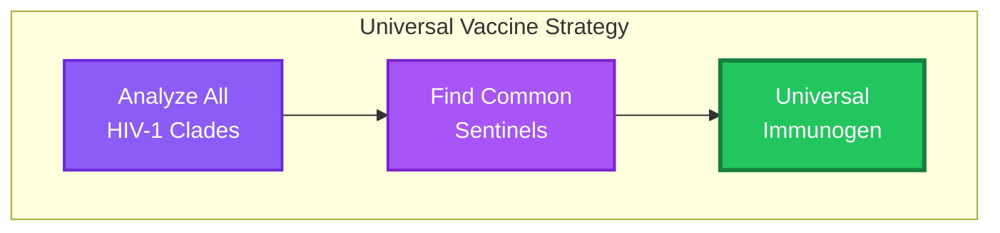

---

## 10. Connection to P-Adic Framework

### 10.1 Why P-Adic Geometry Works

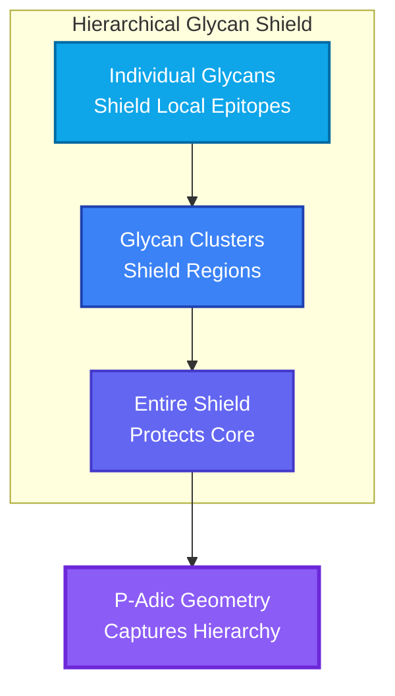

The glycan shield operates hierarchically:

- Individual glycans shield local epitopes
- Glycan clusters shield larger regions
- The entire shield shields the conserved core

P-adic/ultrametric geometry naturally captures this hierarchy:

- Close in p-adic space = similar immunological visibility
- Cluster boundaries = immunological recognition thresholds

### 10.2 The Goldilocks Zone is Universal

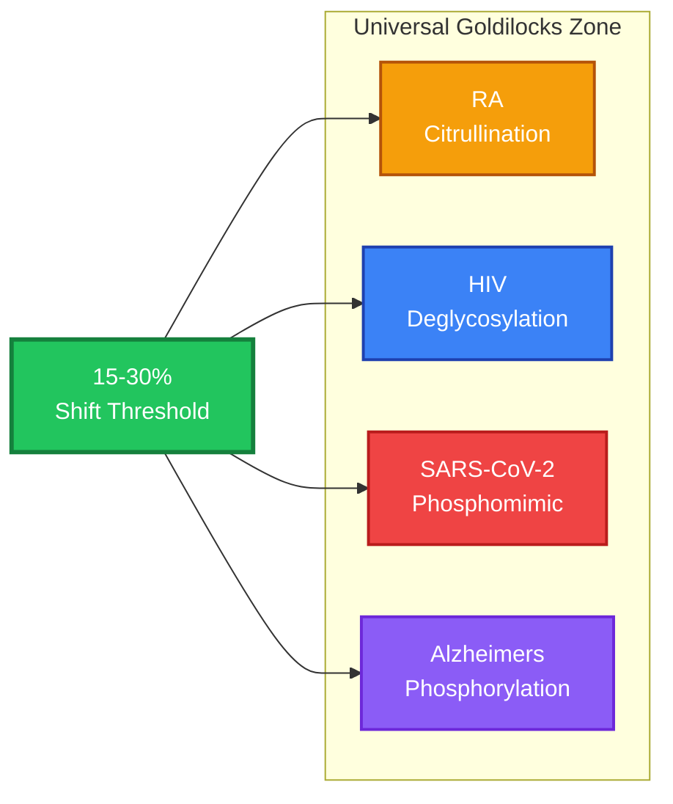

The same [15%, 30%] shift range that predicts:

- RA autoantigen selection (citrullination)
- Should predict HIV bnAb epitope exposure (deglycosylation)

This universality suggests the Goldilocks Zone reflects **fundamental immune recognition thresholds**, not disease-specific phenomena.

---

## 11. Analysis Plan

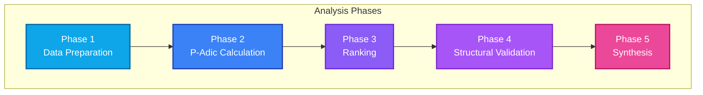

### Phase 1: Data Preparation

- Obtain HIV-1 Env reference sequence (HXB2 or BG505 SOSIP)
- Identify all N-X-S/T sequons
- Extract ±5 residue windows around each N

### Phase 2: P-Adic Calculation

- Encode wild-type windows with 3-adic encoder
- Encode N→Q mutant windows
- Calculate Δ_C for each site
- Classify into Goldilocks zones

### Phase 3: Ranking and Selection

- Rank sites by Goldilocks score
- Cross-reference with known bnAb glycans
- Select top 10-20 candidates for AlphaFold3

### Phase 4: Structural Validation

- Generate AlphaFold3 inputs (WT and mutant Env)
- Predict structures
- Analyze epitope exposure changes

### Phase 5: Synthesis

- Compile sentinel glycan list
- Compare to literature
- Document novel predictions

---

## 12. Expected Outcomes

### Success Criteria

```mermaid
flowchart TB
    subgraph SUCCESS[" Success Criteria "]
        SC1["Known bnAb glycans<br/>in Goldilocks Zone"]
        SC2["Structural glycans<br/>outside zone"]
        SC3["Novel predictions<br/>identified"]
        SC4["AlphaFold3<br/>confirmation"]
    end

    style SC1 fill:#22c55e,stroke:#15803d,color:#ffffff,stroke-width:2px
    style SC2 fill:#22c55e,stroke:#15803d,color:#ffffff,stroke-width:2px
    style SC3 fill:#f59e0b,stroke:#b45309,color:#ffffff,stroke-width:2px
    style SC4 fill:#3b82f6,stroke:#1e40af,color:#ffffff,stroke-width:2px
```

1. **Known bnAb glycans in Goldilocks Zone**: N156, N160, N332 should score in [15%, 30%]
2. **Structural glycans outside zone**: Core glycans should score >30%
3. **Novel predictions**: Identify previously uncharacterized sentinel candidates
4. **AlphaFold3 confirmation**: Structural changes consistent with epitope exposure

### Potential Findings

- **High-confidence sentinels**: Strong candidates for immunogen design
- **Glycan clusters**: Groups that must be removed together
- **Strain-specific sentinels**: Clade-dependent predictions
- **Universal sentinels**: Conserved across all clades

---

## Changelog

| Date       | Version | Description                                        |
| ---------- | ------- | -------------------------------------------------- |
| 2025-12-24 | 2.0     | Added Mermaid diagrams, improved visual structure  |
| 2025-12-24 | 1.1     | Renamed to In Silico Hypothesis                    |
| 2025-12-18 | 1.0     | Initial conjecture document                        |

---

## Related Documents

- [HIV README](../README.md)
- [Discovery Report](../discoveries/DISCOVERY_HIV_PADIC_RESISTANCE.md)
- [Glycan Shield README](./README.md)

---

**Status:** Hypothesis validated through computational analysis | Ready for experimental follow-up
